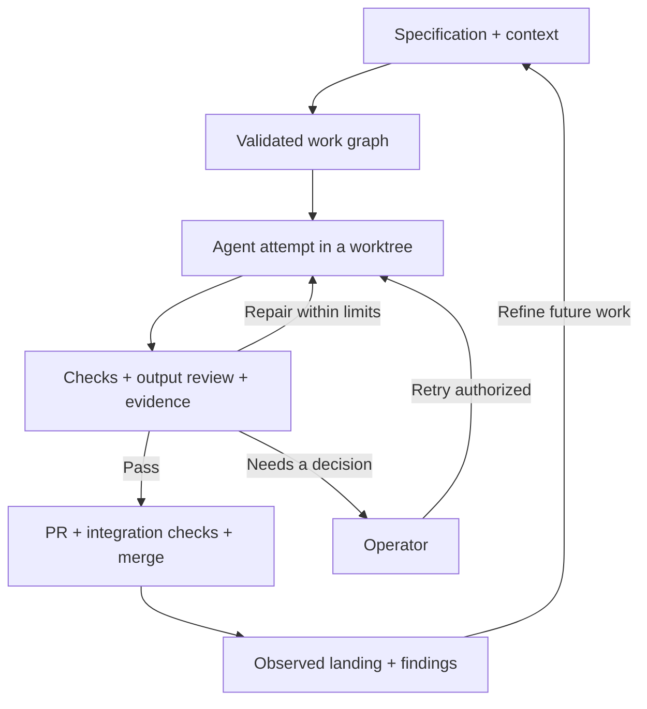

# Ergane

**A software factory for specification-driven development.**

Ergane coordinates coding agents from a written specification through implementation,
verification, and merge. It turns user stories into a dependency graph, runs agents in
their own worktrees, evaluates what they produce, and manages retries, operator
decisions, and landing through a merge queue.

The goal is to make agent execution a repeatable part of software delivery. People
shape the intent, context, acceptance criteria, and operating policy; Ergane manages
the work and records the evidence needed to understand its results.

Ergane is also a reference implementation of that pattern. It is used to develop
Ergane itself, and the repository’s [specifications](specs/) and
[decision log](docs/decisions.md) document how the system has evolved.

**Status: beta, under active development.** Start with a supervised trial on a
dedicated repository. The quality of a result depends on the specification, context,
checks, and review behind it.

[How it works](#how-it-works) · [Get started](#get-started) ·
[Architecture](docs/architecture.md) · [CLI reference](docs/cli/README.md)

## What Ergane coordinates

- **Specifications into executable work.** Parse acceptance criteria, validate the
  spec and its supporting documents, and derive a graph of stories and dependencies.
- **Agent execution.** Select a runner and model through a persona, prepare a
  worktree, and run a bounded attempt with its own execution context.
- **Verification and repair.** Run declared checks, inspect the output, and use
  configured LLM review against acceptance scenarios. Feed failures into a bounded
  retry and escalation policy.
- **Controlled landing.** Open pull requests for passing work and route them through
  integration checks and the repository’s merge queue.
- **Operational visibility.** Inspect attempts, verification records, transcripts,
  usage, pending decisions, and observed landings.
- **Feedback into future work.** Track findings and recurring defects, scaffold new
  specs, and carry reviewed lessons into plans and standards.

## How it works



There are four connected loops:

1. **Refine:** turn an intended outcome into a small, executable assignment with
   explicit acceptance criteria and the context needed to implement it.
2. **Build and repair:** dispatch the assignment, evaluate the candidate, and retry
   or escalate when it cannot progress within its allowance.
3. **Integrate:** check the change in the context of the branch it will join, then
   observe the resulting landing.
4. **Learn:** use findings and operating experience to improve the next spec,
   evaluator, or implementation.

Refinement and learning include operator work. A person or operator agent must
still decide what matters, resolve ambiguity, and review changes to scope or policy.

One execution of a spec is an **epic**. Its dispatched stories are **nodes**; each
invocation of a coding agent is an **attempt**. See the [glossary](CONTEXT.md) for
the full vocabulary.

### What a passing result means

A passing result is relative to the configured verification loop and the evidence
it collected. Deterministic checks, output validation, and LLM review answer
different questions. Read the recorded results and unavailable or skipped checks
alongside the verdict.

Acceptance, landing, and release are separate events. Ergane tracks the path into
the repository; deployment and production acceptance need their own delivery policy.

## The pieces underneath

Ergane combines these responsibilities in its current implementation:

| Responsibility | Implementation |
| --- | --- |
| Intent and context | Spec Kit documents: [spec.md](.specify/templates/spec-template.md), [plan.md](.specify/templates/plan-template.md), and [tasks.md](.specify/templates/tasks-template.md); repository standards |
| Scheduling and durable coordination | Temporal workflows for roadmaps, epics, and operator decisions |
| Coding agents | Claude Code and Codex adapters; persona-based runner, model, scope, and timeout configuration |
| Execution environment | Git worktrees, per-node homes, and a Linux sandbox backend |
| Evaluation | Repository-declared gate commands, output checks, and configurable LLM review |
| Model access and attribution | LiteLLM-compatible gateway integration for leased keys and usage attribution; routing also supports subscription-backed agent execution |
| Landing | A forge interface with GitHub as the reference implementation |
| Evidence and operation | SQLite records, attempt archives, CLI inspection, and notification adapters |

The gateway supplies model access, key lifecycle, and attribution for gateway-routed
attempts. Those properties depend on the selected route; subscription and direct
routes have different credential and accounting behavior. Configure them deliberately
through the [installation flow](docs/cli/install.md).

Runner, forge, and notification interfaces provide extension points. A new backend
still needs an adapter that satisfies the relevant contract. The
[architecture guide](docs/architecture.md) describes those boundaries and their
tradeoffs.

## Get started

### Install the CLI

With Python 3.11+ and [uv](https://docs.astral.sh/uv/) available:

```bash
uv tool install ergane-cli
ergane --help
```

### Configure an engine and target repository

The current runtime needs a Linux execution environment, a Temporal engine and
worker, a configured agent/model route, and the target repository’s toolchain and
verification commands. The GitHub landing path also needs authenticated repository
access and a supported merge-queue configuration.

Follow the [operator setup guide](docs/getting-started.md) for prerequisites and
the setup sequence. Use the [installation reference](docs/cli/install.md) to configure
the control plane and choose an engine deployment. Then follow
[repository initialization](docs/cli/init.md) and [onboarding](docs/cli/repo.md) to
prepare a target. Native worker operation and
container operation are covered in the [worker guide](docs/cli/worker.md) and
[container guide](docs/container.md).

### Try one prepared specification

Author a small feature with [Spec Kit](https://github.com/github/spec-kit):

```text
specs/001-example/
├── spec.md     # Stories, acceptance scenarios, and work-graph declarations
├── plan.md     # Technical context, approach, and known hazards
└── tasks.md    # Implementation tasks grouped by story
```

After the engine and repository are configured, run the following from the target
repository root, replacing the example path with your prepared spec directory:

```bash
ergane spec validate specs/001-example --target-repo "$PWD"
ergane build ship specs/001-example --target-repo "$PWD" --halt-after-pass
```

`build ship` validates the spec, derives the graph, and asks for confirmation before
dispatch. `--halt-after-pass` stops passing work before landing. This executes agents
and checks and can incur model costs; it is an execution trial, not a dry run.
`--target-repo` must resolve on the worker host.

Inspect the result:

```bash
ergane build status 001-example
ergane build attempts 001-example
```

The [build guide](docs/cli/build.md) covers normal landing, recovery, concurrency,
and operator decisions. The [on-ramp exercise](docs/onramp-exercise.md) documents an
end-to-end test against a scratch repository, including its prerequisites and effects.

## Find your way around

| If you want to… | Start here |
| --- | --- |
| Understand the workflows and component boundaries | [Architecture](docs/architecture.md) |
| Understand the project’s terminology | [Glossary](CONTEXT.md) |
| Author, validate, and inspect specifications | [Spec commands](docs/cli/spec.md) and [the spec corpus](specs/) |
| Operate the system | [CLI reference](docs/cli/README.md) |
| Inspect outcomes and failures | [Build records](docs/cli/build.md), [findings](docs/cli/findings.md), and [usage](docs/cli/usage.md) |
| Understand the decisions behind the implementation | [Decision log](docs/decisions.md) |
| Work on Ergane itself | [Contributor orientation](CLAUDE.md) and [repository standards](.specify/memory/constitution.md) |

Implementation lives in [`factory/`](factory/); tests live in [`tests/`](tests/).
Changes to Ergane follow the same specification, verification, and landing process
the project provides to other repositories.

## License

[Apache 2.0](LICENSE).
